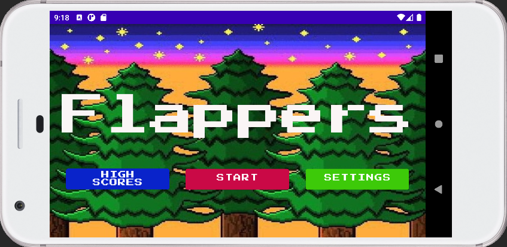
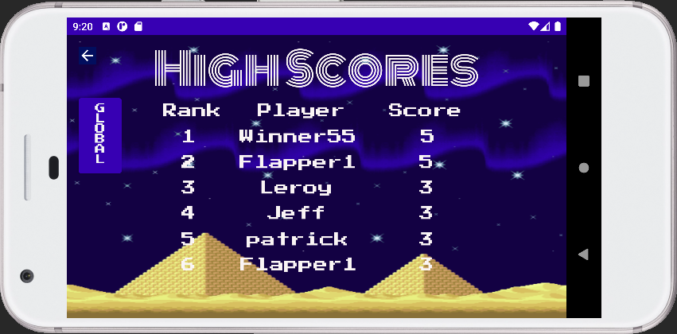
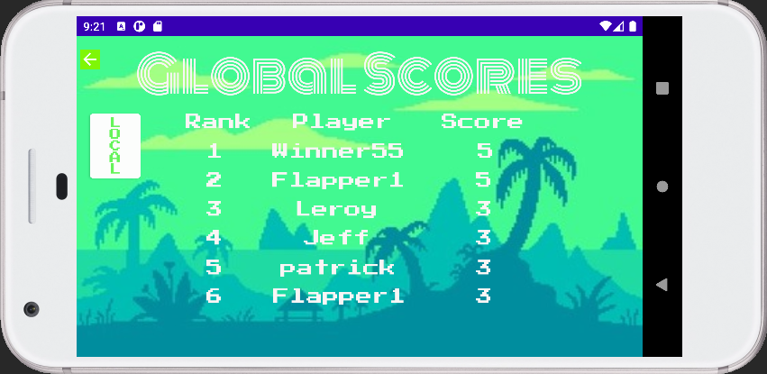
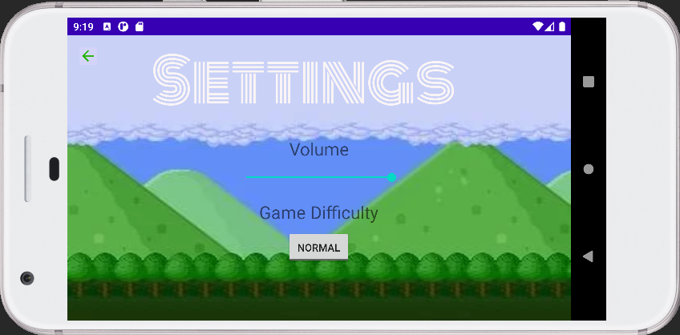
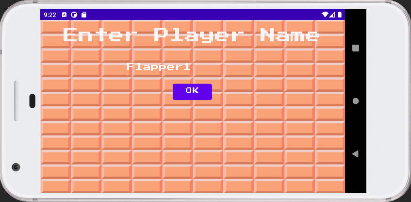
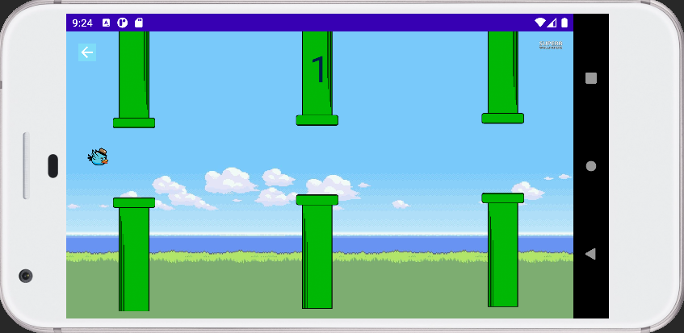
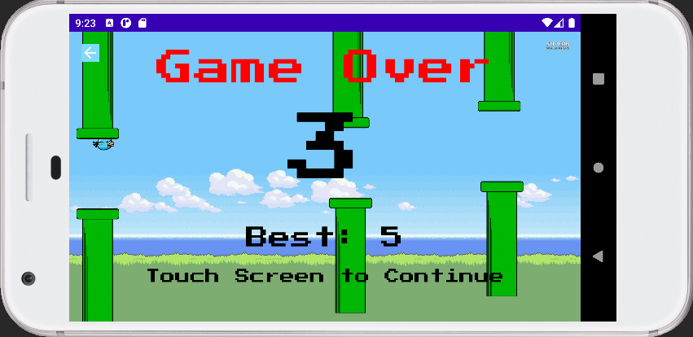

# Flappers Game App

## Objective
Develop an android retro themed game for friends, familiy, and others to play for entertainment with the ability to earn points as you play and break high scores locally and globally. 

## Description
The Flappers game begins at the main menu screen. Here the user will have the option to select one of three buttons: high scores, start, and settings buttons. The first time the app is launched the SQLite database where the scores are kept will be checked. If the database is empty it will be initialized with default score names and values for both the local and global high scores screens. When the high scores button is pressed the first six items from the database are read into the textviews and displayed for the user to see. When the player navigates to the settings screen they have the option to change the game difficulty and volume. When the start button is pressed the user is taken to enter a player name and then can begin playing the game. The game is played by tapping the screen to move the bird up and doing nothing to let the bird fall. The player attempts to move in between approaching pipes without being hit to gain points. When the player dies the score will be checked with the local and global scores and replaced if a high score was obtained. Upon touching the screen after game over the game will reset and the user can play the game again.

## Software
- Android Studio IDE
- Android emulators for app simulation
- Git version control

## Flappers Game in Action

